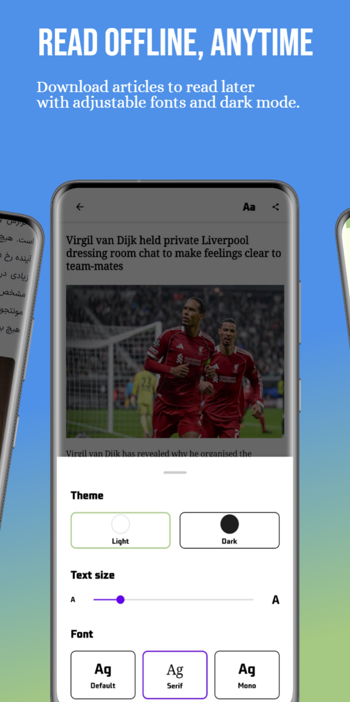
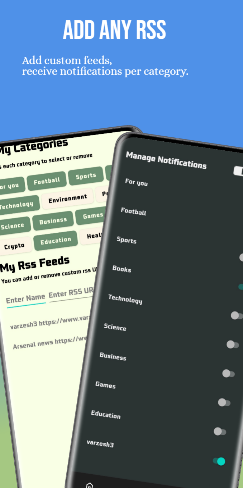
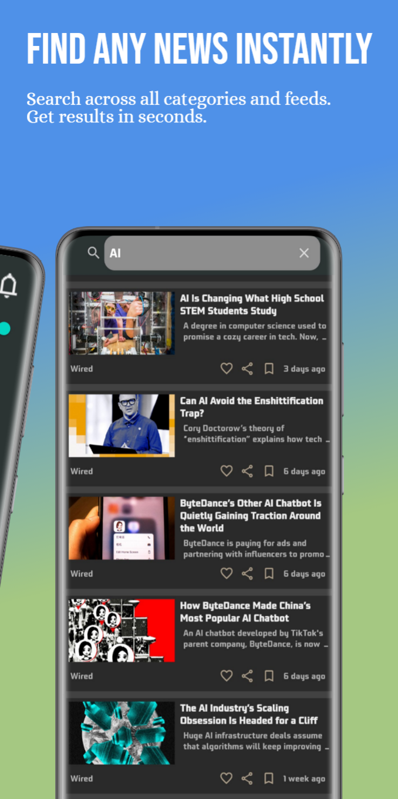
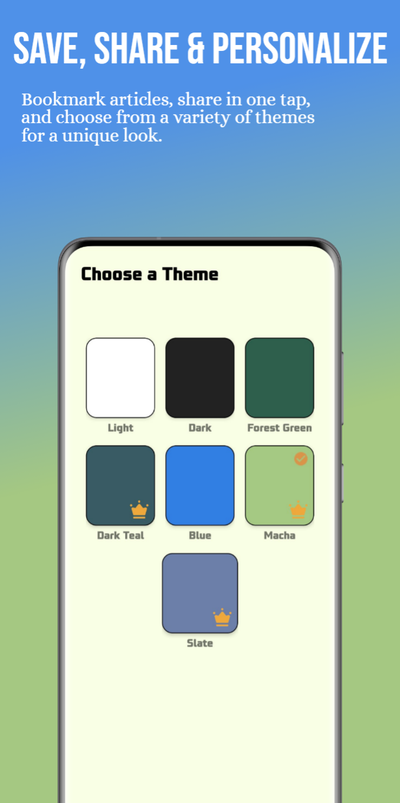

## 📰 RSS News Reader – AI Summarizer

**Smarter, faster news — powered by AI.**  
Aggregate any RSS feed, get instant multilingual summaries, and stay informed effortlessly.

---

### 🌍 Introduction

**RSS News Reader – AI Summarizer** brings you **faster, smarter news**.  
Aggregate any RSS feed, get **AI-generated summaries in English, Persian, and more**, and save articles for **offline reading**.  

Personalize your feed across **13 curated categories**, receive **push alerts** for chosen feeds, and enjoy a comfortable reading experience with **customizable fonts and themes**.

---

### ✨ Features

#### 🧠 AI Summaries (Multilingual)
Instant, concise article summaries generated by AI.  
Save time and stay informed — skim highlights in seconds instead of reading full posts.  
*(AI summaries | article summaries | news summaries)*

#### 📡 Add Any RSS Feed
Subscribe to any source — global outlets, local blogs, or niche sites — and combine them into a single personalized feed.  
Unlimited feeds, tailored to your interests.  
*(RSS reader | feed reader | add RSS)*

#### 🗂️ 13 Curated Categories
Browse organized news across technology, sports, business, politics, science, culture, and more.  
Jump straight to what matters or create your own focused feed.  
*(news categories | curated news)*

#### 🔍 Powerful Search Across Feeds
Find any article instantly. Search across all your feeds and 1,000+ recent articles in a fraction of a second.  
*(search news | find articles fast)*

#### 🔔 Notifications You Control
Real-time push alerts per category or per custom feed.  
Only get notified about the topics that matter to you.  
*(news alerts | RSS notifications)*

#### 📥 Offline Reading & Downloads
Save full articles for offline access. Read downloaded content anywhere with **adjustable font size** and **dark mode**.  
*(offline reading | download articles)*

#### 📑 Bookmarks & One-Tap Sharing
Save articles for later or share them instantly with friends or social apps.  
*(bookmark | share news)*

#### 🎨 Customizable Look & Comfort
Choose **light or dark themes**, tweak fonts, and personalize your reading experience.  
*(themes | customize reader)*

#### ⚡ Fast, Lightweight & Private
Built to be fast even on slow networks and respectful of your privacy.  
Local downloads keep your data in control.  
*(fast news reader | private RSS)*

---

### 📸 Screenshots

🖼️ **App Preview**

  
  
  
  
  

### 📦 Download

👉 [**Download Latest APK**](releases/latest)

**How to install:**
1. Visit the **Releases** section and download the `.apk` file.  
2. Allow installation from unknown sources (if prompted).  
3. Install and enjoy faster, smarter news.

---

### ⚙️ Tech Overview

- **Frontend:** Android (Kotlin, MVVM, XML UI)  
- **Backend:** FastAPI (Python) for AI summarization  
- **AI:** Gemini / LLM-based multilingual summarizer  
- **Storage:** Room Database + Firebase (Auth & Firestore)

---

### 🚀 Roadmap

- 🧠 Enhanced multilingual summarization  
- 🔔 Advanced notification controls  
- 💡 Personalized recommendations  
- 🌙 More themes and font options  
- ☁️ Improved cloud sync

---

### 📬 Contact

Developed by **Benyamin Ramezani**  
📧 [YourEmail@example.com]  
🌐 [Your Website or LinkedIn]

---
